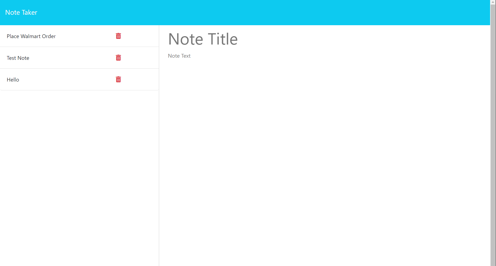

# Note-Taker

## Overview

This is a note taker app, used to take quick notes, look back on old notes, and delete old notes as well.

## Built With

This application is built using Javascript, HTML, Express, JSON.

## Installation

Clone from GitHub repo, npm install, node server.js

## License

MIT (https://choosealicense.com/licenses/mit/)

## Project Status & Future Development

This is a completed project, with no future developments in mind.

GitHub Repo: https://github.com/NicoleBrubaker/Note-Taker

Live Site: https://note-taker-nicolebrubaker-e79b41ab98d6.herokuapp.com/

Screenshot of live site:

